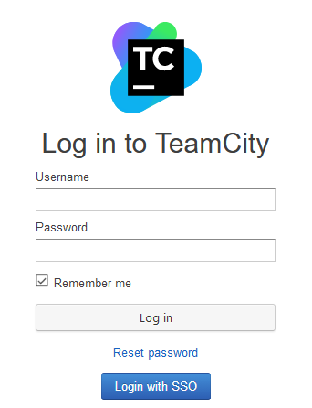
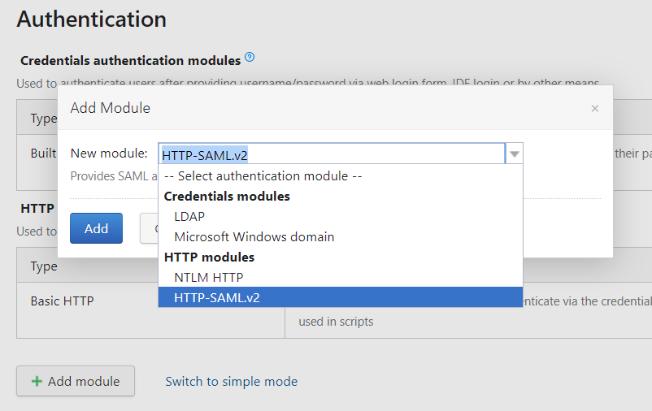

# TeamCity SAML Authentication Plug-In

[](https://travis-ci.org/morincer/teamcity-plugin-saml)

## What's New

* v1.2
    - Add support for multi-certificates configurations (like ADFS-generated metadata) 
* v1.1.1 
    - Fixed issue with wrong callback URL when running behind load balancer 

## Overview

The plug-in adds ability to authenticate users with SAML-based SSO providers. 

Currently tested and reported to work (sometimes - with bit of tweaking) with:

* Okta
* Onelogin
* Keycloak
* ADFS

(Note: if you have other providers you were able to integrate with - drop me a note, please, so I extend the list)

The plug-in offers the following functionality:

* Authenticate SAML assertions for existing users
* Option to automatically create users on login (you may also limit allowed user names by postfix match)
* Wizard to ease configuration of connectivity to common IdP providers  (currently - Okta and Onelogin, more to come in future)
* Option to import IdP metadata from XML

Things the plug-in does NOT currently support (but they're on the roadmap):

* SdP Metadata generation
* Automatic IdP metadata import from URL 
* Multi-tenancy




## Installation

Grab the [latest release](https://github.com/morincer/teamcity-plugin-saml/releases/latest) follow the TeamCity installation instructions ([google](https://www.google.com/search?q=teamcity+install+plugin)).  

## Configuration

The plugin has been tested with Okta and Onelogin but should work fine with other SAML v2 Identity Providers.

* Login as administrator and go to Administration > Authentication

* Switch to advanced mode and add module **HTTP-SAML.v2**



* Under User Management click **SAML Settings**

* Specify values for all the fields in the **Identity Provider Configuration** section. These values are usually shown when configuring SAML SSO connection for your particular identity provider. 


* Use values from the **Service Provider Configuration** section when configuring SAML SSO connection on the identity provider side.

Please refer the example of set up for [Okta](./docs/OktaSetup.md) if you need some details.

* Make sure you have properly set up users on the TeamCity side - their usernames should match the SAML assertion name ID (usually - e-mail). 

* **(IMPORTANT!)** Make sure your CORS settings allow POST requests from the IdP site (check the [Okta](./docs/OktaSetup.md) guide for a sample)

* Logout and click the "Login with SSO" button to test. 

The SAML authentication sequence is a following:

1. When you click the "Login with SSO" button you are redirected to your IdP login page
1. You enter credentials on the login screen, your IdP validates them and, if all is fine, posts a signed SAML-assertion XML to the SSO login callback (<YOUR_SITE>/app/saml/callback/)
1. The assertion contains name ID of the user (usually - e-mail). Plugin searches for users having the same username (not e-mail!) and, if the user is found, authenticates the request. 

 ## Development
 
 The plugin was built with the help of [TeamCity SDK Maven Plugin](https://github.com/JetBrains/teamcity-sdk-maven-plugin). It contains the [build](./build) folder with Maven tasks making life easier.
 
  ...Install and initialize a local TeamCity server version (controlled by teamcity-version property in the parent [pom.xml](./pom.xml)...
 
 ```bash
 mvn tc-sdk:init
 ```
 
 ...Start the server...
 ```bash
 mvn tc-sdk:start
 ```
 
 ...Compile+package the plugin (note that it will also build and package Vue.js part of the plugin)
 ```bash
 mvn package 
 ```

...Deploy it
```bash
mvn tc-sdk:reload
```

### Admin UI Development with Vue

The plugin's admin UI is built using Vue.js framework with Typescript and therefore supports standard Vue-cli-based toolchain.  The Vue part is located in the [vue/admin-ui](./saml-authentication-server/src/main/vue/admin-ui) sub-folder of the plugin and contains it's own package.json file with all the needed dependencies and basic build commands. 

To start the built-in Vue server just use
```bash
npm run serve 
```
And navigate to http://localhost:8080 (to see the admin UI as a standalone controls) or http://localhost:8080/#/demo - to see it in the Teamcity-like design.
